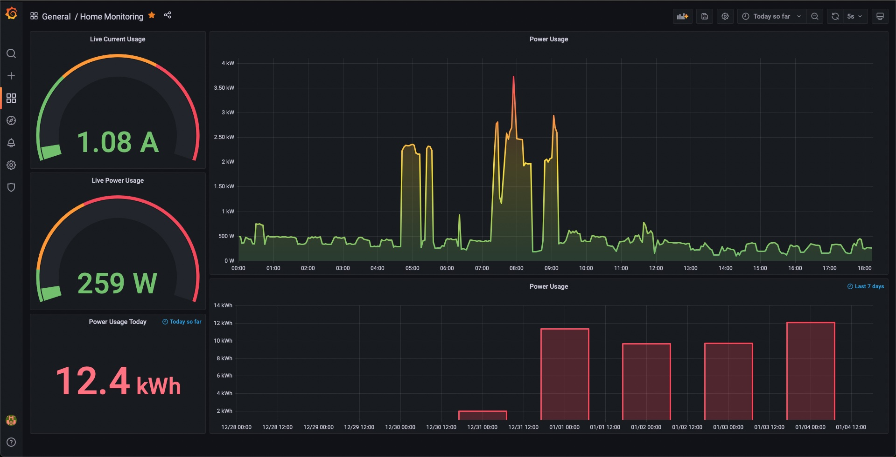

# PowerConsumptionMonitor-ESP32

Power consumption monitor using ESP32 and SCT-013. 

# Hardware

Hardware design and references are explained in the article: https://codetiger.github.io/blog/home-power-consumption-monitoring-using-esp32/

# Software

ESP32 sketch is part of this repo. The Lookup table part of EmonLib.h is from ADC calibration of my ESP32 chip which was done using the repo: https://github.com/e-tinkers/esp32-adc-calibrate

# Monitoring software

I've used Prometheus + Grafana for monitoring the data. Below is the dashboard, I've setup for this monitoring. 

